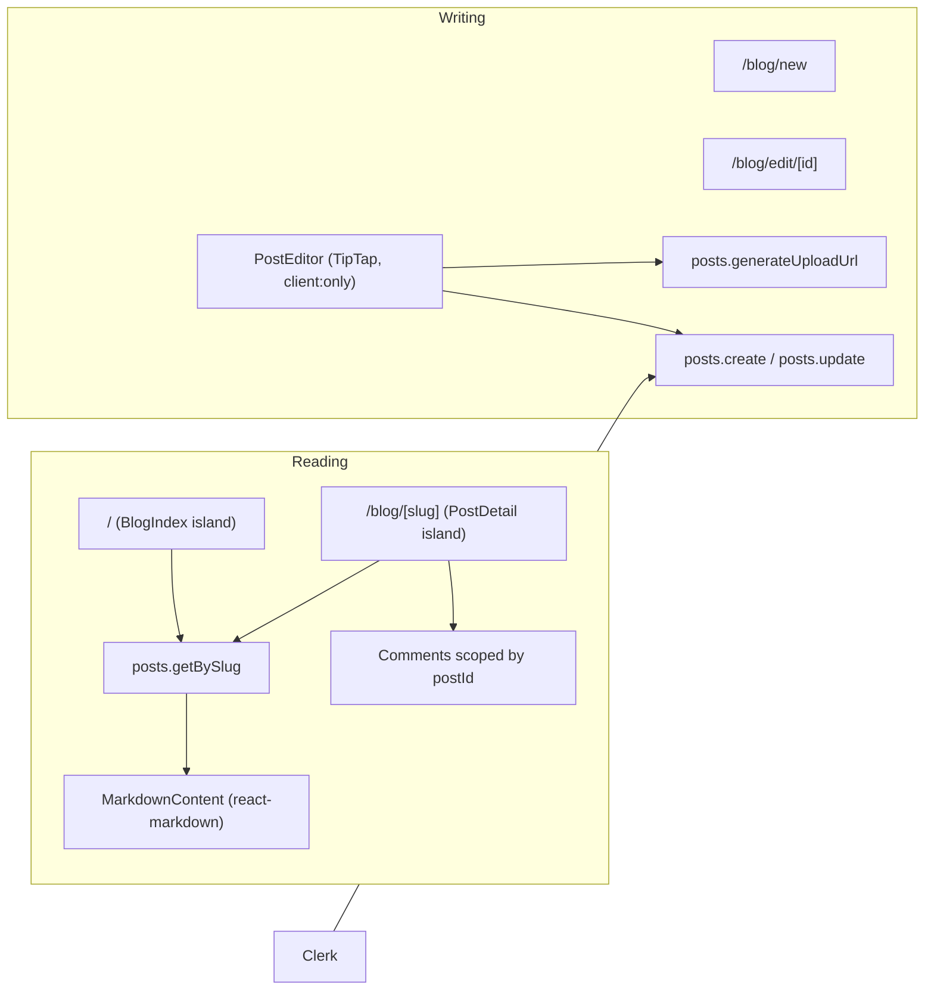

# Blog Design Spec

Status: Approved (2026-07-06)

## Summary

Add a blog to the existing Astro + Convex + Clerk app. Any signed-in user can author posts with a rich TipTap editor and image uploads. Posts are stored as Markdown in Convex and rendered with `react-markdown`. Comments (already in place) become scoped to individual posts. No external CMS.

### Decisions

- **Editor/storage:** Option A — TipTap authoring, Markdown stored in Convex, `react-markdown` for reading, Convex file storage for images.
- **Home page:** `/` becomes the blog index (replaces the standalone global comment board page).
- **Slugs:** Auto-generated from the title at creation time; stable afterward (not regenerated on edit).
- **Drafts:** Supported. Authors can save drafts or publish immediately. Drafts are private to the author.
- **Authoring access:** Any signed-in Clerk user can create and publish.

## Architecture

All reading/writing UI lives in React islands (`client:only="react"`) mounted from Astro pages, wrapped in the existing `withConvexProvider`. Dynamic routes use `prerender = false` (Cloudflare on-demand) because slugs/ids are runtime values.

## Data model

### New `posts` table (`convex/schema.ts`)

| Field | Type | Notes |
|-------|------|-------|
| `authorId` | `v.id("users")` | From `ensureCurrentUser()` |
| `authorName` | `v.string()` | Denormalized display name for list/detail headers |
| `title` | `v.string()` | 1–200 chars |
| `slug` | `v.string()` | URL-safe, unique; generated from title at create |
| `body` | `v.string()` | Markdown |
| `excerpt` | `v.optional(v.string())` | Short summary for cards |
| `coverImageId` | `v.optional(v.id("_storage"))` | Hero image (resolved to URL at read) |
| `status` | `v.union(v.literal("draft"), v.literal("published"))` | |
| `publishedAt` | `v.optional(v.number())` | Set when first published |
| `updatedAt` | `v.number()` | Set on every write |

Indexes:
- `by_slug` on `["slug"]`
- `by_author` on `["authorId"]`
- `by_status_and_published` on `["status", "publishedAt"]` (public listing, newest first)

### `comments` table changes

Add `postId: v.optional(v.id("posts"))` and index `by_post` on `["postId"]`.

- Optional (not required) so existing global comments remain valid data. Blog comment UI always supplies `postId`.
- New query `comments.listByPost({ postId, paginationOpts })` filters via `by_post`.
- New query `comments.countByPost({ postId })`.
- `comments.create` gains optional `postId`; blog comment form always passes it.
- Existing global `comments.list` / `count` / coach tools remain unchanged (coach keeps board-wide context).

## Backend (Convex)

### `convex/lib/slug.ts` (new)

- `slugify(title): string` — lowercase, strip non-alphanumerics to hyphens, collapse/trim hyphens.
- `generateUniqueSlug(ctx, title): Promise<string>` — slugify, then append `-2`, `-3`, ... using `by_slug` lookups until unique.

### `convex/lib/postValidators.ts` (new)

Validators/types for post shapes: `postValidator` (public doc + resolved `coverImageUrl`), `paginatedPostsValidator`, arg validators for create/update.

### `convex/posts.ts` (new)

- `generateUploadUrl` (mutation, auth) → `ctx.storage.generateUploadUrl()`.
- `create` (mutation, auth): args `{ title, body, displayName, excerpt?, coverImageId?, status }`. Generates unique slug, sets `authorName` from `displayName`, `updatedAt`, `publishedAt` (if published). Returns `{ id, slug }`.
- `update` (mutation, auth): args `{ postId, title?, body?, displayName?, excerpt?, coverImageId?, status? }`. Author-only. Keeps slug stable. Sets `publishedAt` on first publish. Updates `updatedAt`. Updates `authorName` when `displayName` is provided.
- `remove` (mutation, auth): author-only delete.
- `listPublished` (query, public): paginated published posts via `by_status_and_published`, newest first, with resolved `coverImageUrl`.
- `listMyDrafts` (query, auth): current user's draft posts.
- `getBySlug` (query, public): returns published post to anyone; returns draft only to its author; otherwise `null`. Resolves `coverImageUrl`.
- `getById` (query, auth): for the edit page; author-only.

Business logic (slug generation, author checks, URL resolution) lives in helpers; wrappers stay thin.

## Frontend

### Shared

- `src/components/MarkdownContent.tsx` (new): extract/generalize the markdown renderer from `AgentMessage.tsx` (adds `img`, headings as real `h1/h2/h3` for article context). `AgentMessage` continues using its compact component; `MarkdownContent` is the article renderer. (Keep them separate to avoid regressing chat styling.)

### Blog reading

- `src/components/blog/BlogIndex.tsx`: paginated card list of published posts (title, author, date, excerpt, cover thumbnail). If signed in, a "Your drafts" section (`listMyDrafts`) with edit links. "New post" button for signed-in users.
- `src/components/blog/PostDetail.tsx`: fetches `getBySlug`, renders cover + title + meta + `MarkdownContent`, a "Draft" badge and Edit link when the viewer is the author. Renders `<PostComments postId={...} />` below.
- `src/pages/index.astro`: `prerender = false`, renders `<BlogIndex client:only />`.
- `src/pages/blog/[slug].astro`: `prerender = false`, reads `Astro.params.slug`, renders `<PostDetail slug={slug} client:only />`. Handles not-found in the island.

### Blog writing

- `src/components/blog/PostEditor.tsx` (`client:only`): TipTap editor with toolbar (bold, italic, headings, lists, quote, code, link, image), title input, excerpt input, cover image upload, "Save draft" / "Publish" actions. Auth-gated (shows sign-in prompt when unauthenticated). Serializes to Markdown via `tiptap-markdown`; parses existing Markdown when editing.
- `src/components/blog/useImageUpload.ts`: helper that calls `posts.generateUploadUrl`, POSTs the file, and returns the stored file URL for insertion into the document / cover.
- `src/pages/blog/new.astro`: renders `<PostEditor client:only />`.
- `src/pages/blog/edit/[id].astro`: `prerender = false`, passes `id` to `<PostEditor postId={id} client:only />`.

### Comments integration

- `CommentForm` and `CommentList` gain an optional `postId` prop. When present, `create` sends it and the list uses `listByPost` / `countByPost`.
- `Comments.tsx` accepts `postId` and passes it through (coach + form + list). A new thin `PostComments` wrapper renders `<Comments postId={...} />`.

### Navigation

- `NavBar.astro`: "Comments" link becomes "Blog" pointing to `/`. Keep "Assistant" and "About".

## Editor packages

- `@tiptap/react`, `@tiptap/pm`, `@tiptap/starter-kit`
- `@tiptap/extension-image`, `@tiptap/extension-link`, `@tiptap/extension-placeholder`
- `tiptap-markdown` (Markdown serialize/parse)

Reading reuses already-installed `react-markdown` + `remark-gfm`.

## Images

- Inline images: upload → `getUrl(storageId)` → insert `` into the Markdown body (Convex storage URLs are stable).
- Cover image: store `coverImageId` (`_storage` id); resolve to `coverImageUrl` at read time in queries.

## Auth & access rules

- `create` / `update` / `remove` / `generateUploadUrl`: require auth (`ensureCurrentUser`).
- `update` / `remove` / `getById`: author-only (`post.authorId === user._id`), else throw.
- `getBySlug`: published visible to all; draft visible only to author; else `null`.
- `listPublished`: public, published only.

## Error handling

- Slug collisions resolved automatically (never surfaced as errors).
- Title/body validation with clear messages (empty title, empty body, length caps).
- Editor upload failures show inline error and keep the draft intact.
- Post detail island renders a friendly "Post not found" state for `null`.
- Reuse existing error-boundary pattern for the comments section on post pages.

## Out of scope (v1)

- Sanity / external CMS.
- Static prerendering of posts for SEO (islands are client-rendered; can add SSR later).
- Nested comment replies, full-text search, moderation queue.
- Admin roles / publish approval (any signed-in user publishes).
- Slug editing / regeneration on title change.

## Testing (manual)

1. Sign in, create a draft, confirm it appears only in "Your drafts" and is hidden from the public index.
2. Publish; confirm it appears in the index and at `/blog/[slug]`.
3. Upload a cover and an inline image; confirm both render on the detail page.
4. Add comments on two different posts; confirm each post shows only its own comments.
5. Edit a published post; confirm slug is unchanged and `updatedAt` changes.
6. Visit another user's draft slug while signed in as a non-author; confirm "not found".
7. `pnpm typecheck` and `pnpm lint` pass.
